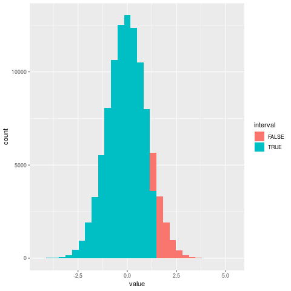
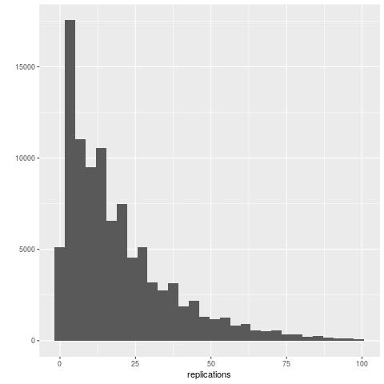

\usepackage[margin=0.75in]{geometry}

\renewcommand{\familydefault}{\sfdefault}

\usepackage{xcolor}

\usepackage{fancyhdr}

\pagestyle{fancyplain}

\chead{Assignment 4 - Practical Statistics with R}

\lhead{Guilherme G. Haetinger}

\rhead{Fall 2019}

\usemintedstyle{friendly}

\thispagestyle{empty}

------------------------------------------------------------------------

**Area under the curve**
========================

What percent of a standard normal distribution $N(\mu = 0; \sigma = 1)$
is found in each region? Be sure to draw a graph.

``` {.r .rundoc-block rundoc-language="R" rundoc-exports="both" rundoc-results="graphics" rundoc-file="normal.png" rundoc-session="yes"}
normal <- rnorm(100000, 0, 1)
ggplot(data.frame(value = normal), aes(value)) + geom_histogram()
```

$Z < 1.35$
----------

``` {.r .rundoc-block rundoc-language="R" rundoc-exports="both" rundoc-results="value" rundoc-session="yes"}
pnorm(1.35, 0, 1, lower.tail = TRUE)
```

``` {.r .rundoc-block rundoc-language="R" rundoc-exports="both" rundoc-results="graphics" rundoc-file="1-1.png" rundoc-session="yes"}
normal_1 <- data.frame(value = normal)
normal_1$interval <- normal_1$value < 1.35
ggplot(normal_1, aes(value, fill = interval)) + geom_histogram()
```



$Z > 1.48$
----------

``` {.r .rundoc-block rundoc-language="R" rundoc-exports="both" rundoc-results="value" rundoc-session="yes"}
pnorm(1.48, 0, 1, lower.tail = FALSE)
```

``` {.r .rundoc-block rundoc-language="R" rundoc-exports="both" rundoc-results="graphics" rundoc-file="1-2.png" rundoc-session="yes"}
normal_2 <- data.frame(value = normal)
normal_2$interval <- normal_2$value > 1.48
ggplot(normal_2, aes(value, fill = interval)) + geom_histogram()
```

$-0.4 < Z < 1.5$
----------------

``` {.r .rundoc-block rundoc-language="R" rundoc-exports="both" rundoc-results="value" rundoc-session="yes"}
lower <- pnorm(-0.4, 0, 1, lower.tail = TRUE)
upper <- pnorm(1.5, 0, 1, lower.tail = FALSE)
lower * upper
```

``` {.r .rundoc-block rundoc-language="R" rundoc-exports="both" rundoc-results="graphics" rundoc-file="1-3.png" rundoc-session="yes"}
normal_3 <- data.frame(value = normal)
normal_3$interval <- normal_3$value < 1.5 & normal_3$value > -0.4
ggplot(normal_3, aes(value, fill = interval)) + geom_histogram()
```

$|Z| > 2$
---------

``` {.r .rundoc-block rundoc-language="R" rundoc-exports="both" rundoc-results="value" rundoc-session="yes"}
negative <- pnorm(-2, 0, 1, lower.tail = FALSE)
positive <- pnorm(2, 0, 1, lower.tail = TRUE)
negative * positive
```

``` {.r .rundoc-block rundoc-language="R" rundoc-exports="both" rundoc-results="graphics" rundoc-file="1-4.png" rundoc-session="yes"}
normal_4 <- data.frame(value = normal)
normal_4$mod2 <- normal_4$value < -2 | normal_4$value > 2
ggplot(normal_4, aes(value, fill = mod2)) + geom_histogram()
```

**GRE Scores Part II**
======================

Sophia who took the Graduate Record Examination (GRE) scored 160 on the
Verbal Reasoning section and 157 on the Quantitative Reasoning section.
The mean score for Verbal Reasoning section for all test takers was 151
with a standard deviation of 7, and the mean score for the Quantitative
Reasoning was 153 with a standard deviation of 7.67. Suppose that both
distributions are nearly normal.

Write down the short-hand for these two normal distributions.
-------------------------------------------------------------

$Reasoning = N(\mu = 151, \sigma = 7)$,
$Quantitative = N(\mu = 153, \sigma = 7.67)$

What is Sophia's Z-score on the Verbal Reasoning section? On the Quantitative Reasoning section? Draw a standard normal distribution curve and mark these two Z-scores.
-----------------------------------------------------------------------------------------------------------------------------------------------------------------------

$Z_{Reasoning} = \frac{160 - 151}{7} = 1.28, Z_{Quantitative} = \frac{157 - 153}{7.67} = 0.52$.

``` {.r .rundoc-block rundoc-language="R" rundoc-exports="both" rundoc-results="graphics" rundoc-file="z_scores.png" rundoc-session="yes"}
reason_z_score <- (160-151)/7
quant_z_score <- (157-153)/7.67
normal <- rnorm(100000)
ggplot(data.frame(value = normal), aes(value)) + geom_histogram(fill = "black") +
  geom_vline(xintercept = reason_z_score,
             linetype = "dotted", color = "red", size = 1.5) +
  geom_vline(xintercept = quant_z_score,
             linetype = "dotted", color = "green", size = 1.5)
```

What do these Z-scores tell you?
--------------------------------

That Sophia is $1.28$ standard deviations above average on the Reasoning
test and $0.52$ above it.

Relative to others, which section did she do better on?
-------------------------------------------------------

On the Reasoning exam.

Find her percentile scores for the two exams.
---------------------------------------------

**Reasoning**

``` {.r .rundoc-block rundoc-language="R" rundoc-exports="both" rundoc-results="value" rundoc-session="yes"}
pnorm(160, 151, 7)
```

**Quantitative**

``` {.r .rundoc-block rundoc-language="R" rundoc-exports="both" rundoc-results="value" rundoc-session="yes"}
pnorm(157, 153, 7.67)
```

What percent of the test takers did better than her on the Verbal Reasoning section? On the Quantitative Reasoning section?
---------------------------------------------------------------------------------------------------------------------------

**Reasoning**

``` {.r .rundoc-block rundoc-language="R" rundoc-exports="both" rundoc-results="value" rundoc-session="yes"}
1 - pnorm(160, 151, 7)
```

**Quantitative**

``` {.r .rundoc-block rundoc-language="R" rundoc-exports="both" rundoc-results="value" rundoc-session="yes"}
1 - pnorm(157, 153, 7.67)
```

Explain why simply comparing raw scores from the two sections could lead to an incorrect conclusion as to which section a student did better on.
------------------------------------------------------------------------------------------------------------------------------------------------

Because even if a score is bigger, it can be less than the mean for its
specific exam, for example. Therefore we have to compare them with the
standard deviations above/below the mean (Z-score).

If the distributions of the scores on these exams are not nearly normal, would your answers to parts (2) - (6) change? Explain your reasoning.
----------------------------------------------------------------------------------------------------------------------------------------------

No, we can still calculate a normal distribution using the values of the
mean and standard deviation.

**LA Weather, Part I**
======================

The average daily high temperature in June in LA is 77F with a standard
deviation of 5F. Suppose that the temperatures in June closely follow a
normal distribution.

What is the probability of observing an 83F temperature or higher in LA during a randomly chosen day in June?
-------------------------------------------------------------------------------------------------------------

``` {.r .rundoc-block rundoc-language="R" rundoc-exports="both" rundoc-results="value" rundoc-session="yes"}
1 - pnorm(83, 77, 5)
```

How cool are the coldest 10% of the days (days with lowest average high temperature) during June in LA?
-------------------------------------------------------------------------------------------------------

``` {.r .rundoc-block rundoc-language="R" rundoc-exports="both" rundoc-results="value" rundoc-session="yes"}
qnorm(0.1, 77, 5)
```

**With and without replacement**
================================

In the following situations assume that half of the specified population
is male and the other half is female.

Suppose you're sampling from a room with 10 people. What is the probability of sampling two females in a row when sampling with replacement? What is the probability when sampling without replacement?
-------------------------------------------------------------------------------------------------------------------------------------------------------------------------------------------------------

With replacements $\to (\frac{5}{10})^2 = \frac{1}{4}$, without
replacements $\to \frac{5}{10}*\frac{4}{9}$.

Now suppose you're sampling from a stadium with 10,000 people. What is the probability of sampling two females in a row when sampling with replacement? What is the probability when sampling without replacement?
------------------------------------------------------------------------------------------------------------------------------------------------------------------------------------------------------------------

With replacements $\to (\frac{5000}{10000})^2 = \frac{1}{4}$, without
replacements
$\to \frac{5000}{10000}*\frac{4999}{9999} = \frac{1}{2}*\frac{4999}{9999}$.

We often treat individuals who are sampled from a large population as independent. Using your findings from parts (a) and (b), explain whether or not this assumption is reasonable.
------------------------------------------------------------------------------------------------------------------------------------------------------------------------------------

I guess that makes sense since the sampling without replacement in the
larger population ended up not being really affected by samples while
the smaller population ended up being really affected because the
sampling was the same in both, creating disproportional results.

**Defective rate**
==================

A machine that produces a special type of transistor (a component of
computers) has a 2% defective rate. The production is considered a
random process where each transistor is independent of the others.

What is the probability that the 10th transistor produced is the first with a defect?
-------------------------------------------------------------------------------------

$0.98^{9} * 0.2$.

``` {.r .rundoc-block rundoc-language="R" rundoc-exports="both" rundoc-results="value" rundoc-session="yes"}
1 - pgeom(8, .02) * .02
```

What is the probability that the machine produces no defective transistors in a batch of 100?
---------------------------------------------------------------------------------------------

*0.98^100^*

``` {.r .rundoc-block rundoc-language="R" rundoc-exports="both" rundoc-results="value" rundoc-session="yes"}
1 - pgeom(100, .2)
```

On average, how many transistors would you expect to be produced before the first with a defect? What is the standard deviation?
--------------------------------------------------------------------------------------------------------------------------------

``` {.r .rundoc-block rundoc-language="R" rundoc-exports="both" rundoc-results="graphics" rundoc-file="geom.png" rundoc-session="yes"}
replications <- replicate(100000, which(rbinom(100, 1, 0.02) == 1)[1])
qplot(replications)
```

``` {.r .rundoc-block rundoc-language="R" rundoc-exports="both" rundoc-results="value" rundoc-session="yes"}
# Replicate this 100,000 times using replicate()
replications <- replicate(100000, which(rbinom(100, 1, 0.02) == 1)[1])

# Histogram the replications with qplot
mean(replications, na.rm = TRUE)
```

By this geometric distribution, we can expect that the transistors will
have problems around transistor 34.
$\sigma = \frac{0.02}{0.98^2} = 0.144$

Another machine that also produces transistors has a 5% defective rate where each transistor is produced independent of the others. On average how many transistors would you expect to be produced with this machine before the first with a defect? What is the standard deviation?
-------------------------------------------------------------------------------------------------------------------------------------------------------------------------------------------------------------------------------------------------------------------------------------

``` {.r .rundoc-block rundoc-language="R" rundoc-exports="both" rundoc-results="graphics" rundoc-file="geom.png" rundoc-session="yes"}
replications <- replicate(100000, which(rbinom(100, 1, 0.05) == 1)[1])
qplot(replications)
```



``` {.r .rundoc-block rundoc-language="R" rundoc-exports="both" rundoc-results="value" rundoc-session="yes"}
# Replicate this 100,000 times using replicate()
replications <- replicate(100000, which(rbinom(100, 1, 0.05) == 1)[1])

# Histogram the replications with qplot
mean(replications, na.rm = TRUE)
```

By this geometric distribution, we can expect that the transistors will
have problems around transistor 19.
$\sigma = \frac{0.05}{0.98^2} = 0.228$

Based on your answers to parts (3) and (4), how does increasing the probability of an event affect the mean and standard deviation of the wait time until success?
------------------------------------------------------------------------------------------------------------------------------------------------------------------

The standard deviation grew with the probability as the expected number
of transistors before failure decreased.

**Chicken pox (Part I)**
========================

The National Vaccine Information Center estimates that 90% of Americans
have had chickenpox by the time they reach adulthood.

Suppose we take a random sample of 100 American adults. Is the use of the binomial distribution appropriate for calculating the probability that exactly 97 out of 100 randomly sampled American adults had chickenpox during childhood? Explain.
-------------------------------------------------------------------------------------------------------------------------------------------------------------------------------------------------------------------------------------------------

Yes, because the sample size is large.

Calculate the probability that exactly 97 out of 100 randomly sampled American adults had chickenpox during childhood.
----------------------------------------------------------------------------------------------------------------------

Considering a binomial distribution, we have $\mu = 90, \sigma = 3$.
This way we can calculate the probability using R:

``` {.r .rundoc-block rundoc-language="R" rundoc-exports="both" rundoc-results="value" rundoc-session="yes"}
dbinom(97, 100, .9)
```

What is the probability that exactly 3 out of a new sample of 100 American adults have not had chickenpox in their childhood?
-----------------------------------------------------------------------------------------------------------------------------

The same as the previous question.

What is the probability that at least 1 out of 10 randomly sampled American adults have had chickenpox?
-------------------------------------------------------------------------------------------------------

Considering a binomial distribution, we have $\mu = 9, \sigma = 0.94$.
This way we can calculate the probability using R:

``` {.r .rundoc-block rundoc-language="R" rundoc-exports="both" rundoc-results="value" rundoc-session="yes"}
dbinom(1, 10, .9)
```

What is the probability that at most 3 out of 10 randomly sampled American adults have not had chickenpox?
----------------------------------------------------------------------------------------------------------

Considering a binomial distribution, we have $\mu = 9, \sigma = 0.94$.
This way we can calculate the probability using R:

``` {.r .rundoc-block rundoc-language="R" rundoc-exports="both" rundoc-results="value" rundoc-session="yes"}
1 - dbinom(7, 10, .9)
```

**Chicken pox (Part II)**
=========================

We learned in Exercise 4.18 that about 90% of American adults had
chickenpox before adulthood. We now consider a random sample of 120
American adults.

How many people in this sample would you expect to have had chickenpox in their childhood? And with what standard deviation?
----------------------------------------------------------------------------------------------------------------------------

The variables can be calculated as such:
$\mu = 0.9 * 120 = 108, \sigma = \sqrt{120*0.9(0.1)} = \sqrt{10.8}$.

Would you be surprised if there were 105 people who have had chickenpox in their childhood?
-------------------------------------------------------------------------------------------

No, because it's an error within the standard deviation, meaning that a
difference of 3 is too low to raise suspicious around the sampling.

What is the probability that 105 or fewer people in this sample have had chickenpox in their childhood? How does this probability relate to your answer to part (b)?
--------------------------------------------------------------------------------------------------------------------------------------------------------------------

We can calculate it using R:

``` {.r .rundoc-block rundoc-language="R" rundoc-exports="both" rundoc-results="value" rundoc-session="yes"}
pbinom(105, 120, .9)
```

As we can see, the probability is low, so we should be surprised if that
is the case on part (b).

**Rolling a die**
=================

Calculate the following probabilities and indicate which probability
distribution model is appropriate in each case. You roll a fair die 5
times. What is the probability of rolling

the first 6 on the fifth roll?
------------------------------

We can use geometric distribution computation for the case as well as
the following equation $\frac{5}{6}^4*\frac{1}{6}$.

``` {.r .rundoc-block rundoc-language="R" rundoc-exports="both" rundoc-results="value" rundoc-session="yes"}
1 - pgeom(3, 1/6) * 1/6
```

We can also use the Negative Binomial distribution to calculate it. It
goes as follows: $\binom{4}{0}(\frac{1}{6})^{1}(\frac{5}{6})^{4}$.

exactly three 6s?
-----------------

We can use the same distribution to calculate the probability of the
third success in every position times the probability that there are no
more 6s in any other position. The equation goes as follows:

\begin{eqnarray*}
     \binom{2}{2}(\frac{1}{6})^{3}(\frac{5}{6})^{0} * \frac{5}{6}^2 +& \\
     \binom{3}{2}(\frac{1}{6})^{4}(\frac{5}{6})^{1} * \frac{5}{6} +&\\
     \binom{4}{2}(\frac{1}{6})^{5}(\frac{5}{6})^{2} = 0.004\\
\end{eqnarray*}

the third 6 on the fifth roll?
------------------------------

We can just use it simply as such:
$\binom{4}{2}(\frac{1}{6})^{5}(\frac{5}{6})^{2}$

**Customers at a coffee shop**
==============================

A coffee shop serves an average of 75 customers per hour during the
morning rush.

Which distribution have we studied that is most appropriate for calculating the probability of a given number of customers arriving within one hour during this time of day?
----------------------------------------------------------------------------------------------------------------------------------------------------------------------------

The Poisson distribution.

What are the mean and the standard deviation of the number of customers this coffee shop serves in one hour during this time of day?
------------------------------------------------------------------------------------------------------------------------------------

$\mu = 75, \sigma = \sqrt{75} = 8.66$.

Would it be considered unusually low if only 60 customers showed up to this coffee shop in one hour during this time of day?
----------------------------------------------------------------------------------------------------------------------------

Yes, it's more than one standard deviation of difference from the mean.

Calculate the probability that this coffee shop serves 70 customers in one hour during this time of day.
--------------------------------------------------------------------------------------------------------

$P(70) = \frac{75^{70}e^{-75}}{70!}$.

``` {.r .rundoc-block rundoc-language="R" rundoc-exports="both" rundoc-results="value" rundoc-session="yes"}
ppois(70, lambda=75)
```

**Lost baggage**
================

Occasionally an airline will lose a bag. Suppose a small airline has
found it can reasonably model the number of bags lost each weekday using
a Poisson model with a mean of 2.2 bags.

What is the probability that the airline will lose no bags next Monday?
-----------------------------------------------------------------------

``` {.r .rundoc-block rundoc-language="R" rundoc-exports="both" rundoc-results="value" rundoc-session="yes"}
ppois(0, lambda=2.2)
```

What is the probability that the airline will lose 0, 1, or 2 bags on next Monday?
----------------------------------------------------------------------------------

``` {.r .rundoc-block rundoc-language="R" rundoc-exports="both" rundoc-results="value" rundoc-session="yes"}
ppois(0, lambda=2.2) + ppois(1, lambda=2.2) + ppois(2, lambda=2.2)
```

So the airline will definitely lose 2 or less bags.

Suppose the airline expands over the course of the next 3 years, doubling the number of flights it makes, and the CEO asks you if it's reasonable for them to continue using the Poisson model with a mean of 2.2. What is an appropriate recommendation? Explain.
------------------------------------------------------------------------------------------------------------------------------------------------------------------------------------------------------------------------------------------------------------------

The mean will not be of 2.2 anymore. The company should observe the
events and record a new mean, proportional to the new size of the
population.
